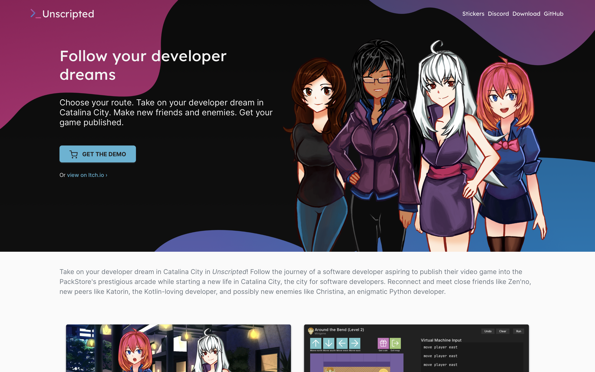

# Mastina Theme
A basic theme for the Nikola static site generator.

## Installation

To install this theme, clone this directory into the `themes` folder of your Nikola project.

## Configuration

Please see the helper templates in `templates` to see what can be customized.

## License

The primary Mastina project is licensed under the Mozilla Public License. Some dependencies are available under different licenses:

- Feather icons: MIT License
- Dracula theme: MIT License
- Highlight.js: BSD-3-Clause
- Moment.js: MIT License